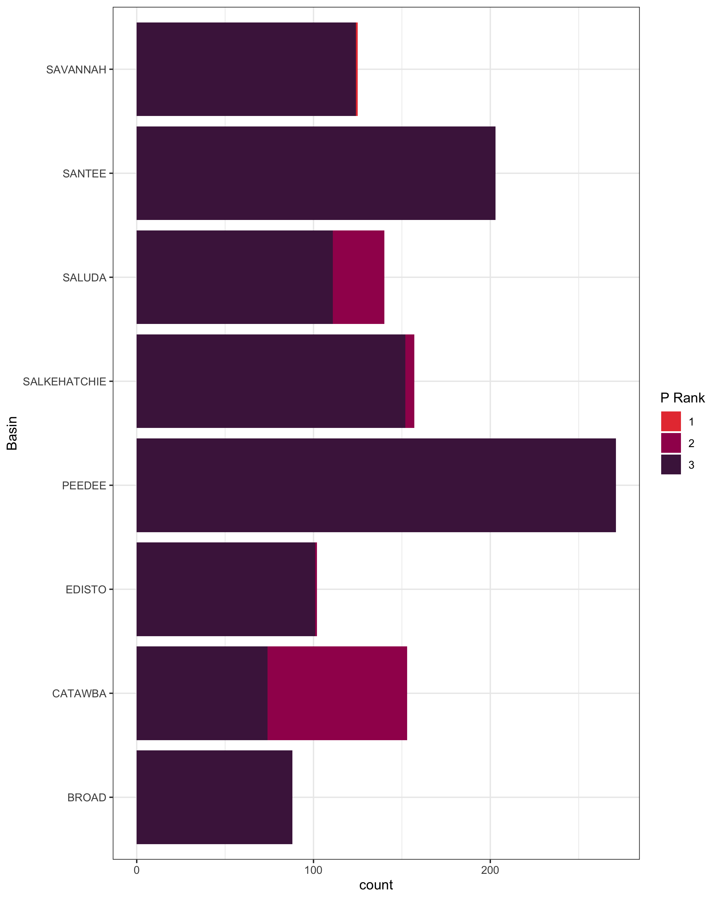
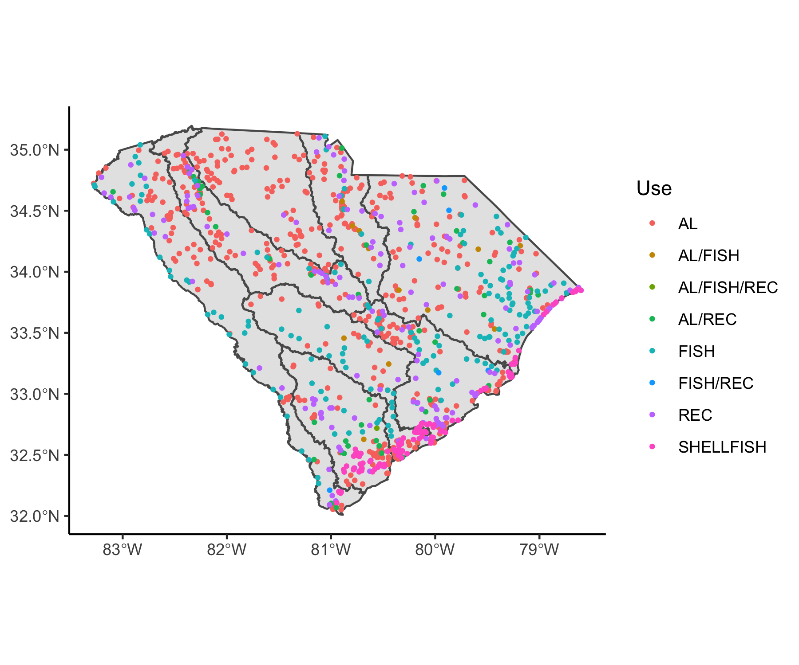
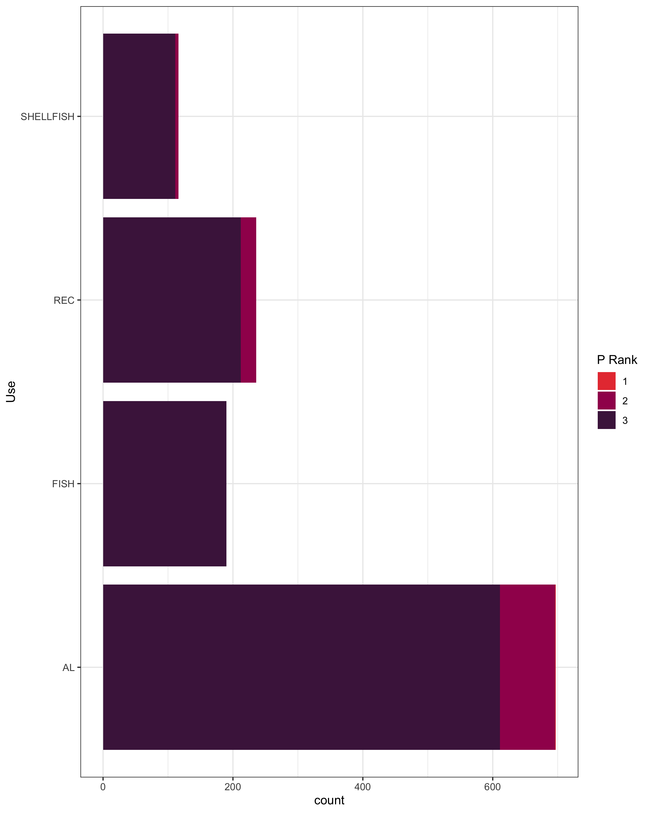
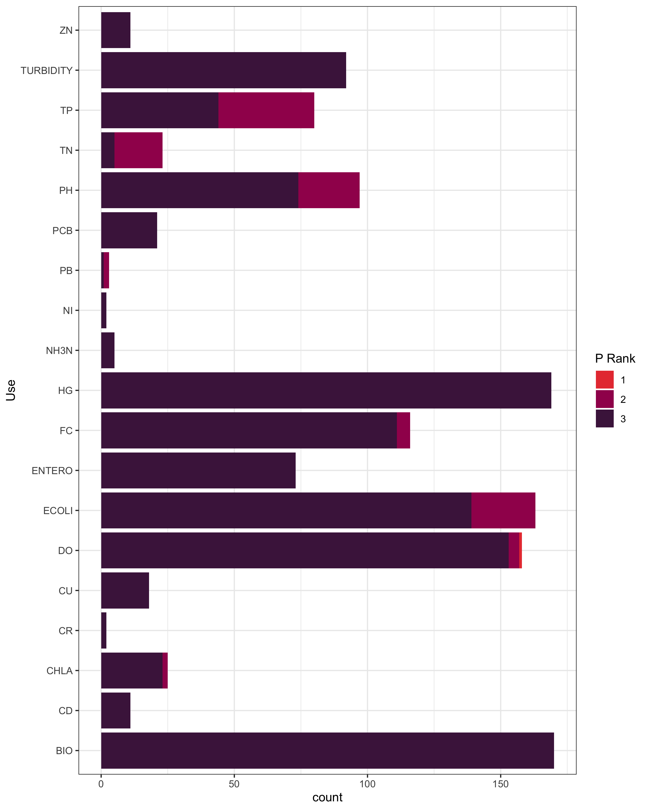
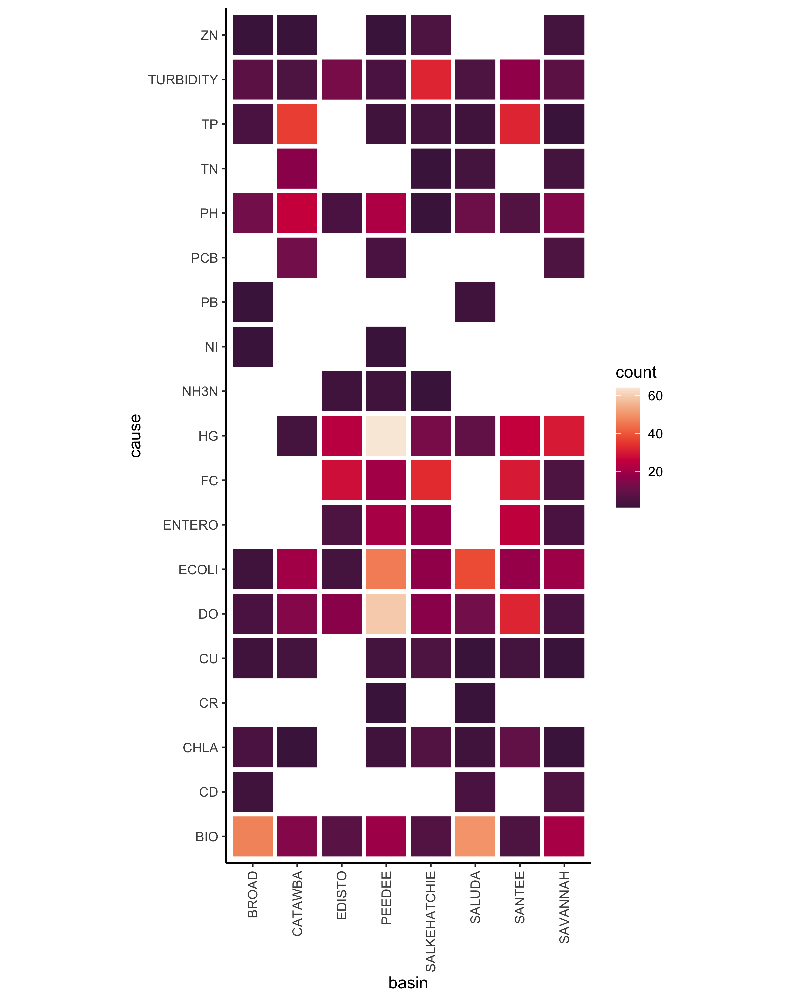
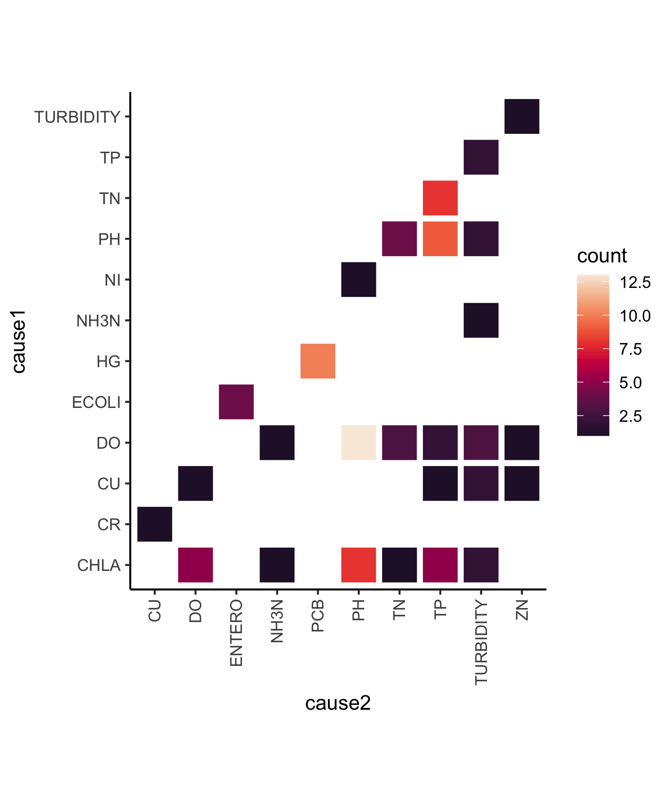
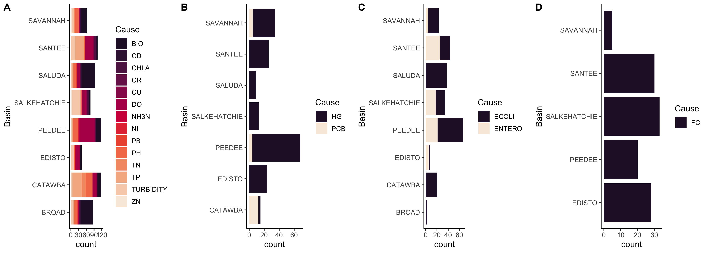

# SPELL CHECK THIS

Intro:
The 303d list identifies impaired water bodies within each state, listing uses of the water body and causes of impairment. The goal of our project was to understand the relationship between causes of impairment and priority ranking. We hypothesized that basins with an increased number of impaired waters due to a multitude of causes would rank higher in priority. To test this hypothesis, we looked for relationships between priority ranking with respect to basin, cause, and use utilizing data from the 2018 303d list to disseminate trends. 

### Priority ranks

The priority ranks are defined as:

1 = __Current Priorities__ are those site/pollutant combinations being addressed by TMDL or
alternative restoration plans being developed during the 2016-2018 time-frame.

2 = __Near Term Priorities__ are those site/pollutant combinations being addressed by TMDL or alternative restoration plans being developed during the 2019-2022 time-frame.

3 = __Long Term Priorities__ are those site/pollutant combinations being addressed by TMDL or
alternative restoration plans being developed after 2022.

## Basin and priority rank:

{width=70%}
From the above figure, we see that the number of priority rankings ranges from approximately 80 in the Broad basin to about 280 for the Pee Dee. We also observed that the Catawba has a larger number of higher ranked waters than any other basin. Finally, we observed that most of the water bodies within each basin have been listed as priority 3.  Our next steps were to examine how much of each basin hosts impaired water bodies and to look at uses and causes of impairment. 

BROAD_IMPAIRED=(79/(79+117))*100
CATAWBA_IMPAIRED=(104/(32+104))*100
EDISTO_IMPAIRED=(95/(95+95))*100
PEEDEE_IMPAIRED=(229/(229+170))*100
SALKEHATCHIE_IMPAIRED=(128/(128+171))*100
SALUDA_IMPAIRED=(121/(121+76))*100
SANTEE_IMPAIRED=(171/(171+260))*100
SAVANNAH_IMPAIRED=(113/(113+177))*100

basin_percent_imp<- rbind(BROAD_IMPAIRED, CATAWBA_IMPAIRED, EDISTO_IMPAIRED, PEEDEE_IMPAIRED, SALKEHATCHIE_IMPAIRED,SALUDA_IMPAIRED,SAVANNAH_IMPAIRED)
  
basin_percent_imp <- as.data.frame.matrix(basin_percent_imp)

basin_percent_imp$V1 <- round(basin_percent_imp$V1, 0)

names(basin_percent_imp) <- "percent"

t.test(basin_percent_imp)

From the above table, we see that the percent impairment for South Carolina basins ranges from 39% to 76%. The Catawba has the largest percent of impaired water bodies which corresponds with this basin also having the highest number of priority 2 rankings. Based on the large number of basins with priority rankings of 3, we decided to run a t-test using a 95% confidence interval to determine if the percent impairment of each basin is significant, and indeed they were (p = 5e-05). Seeing that priority rankings do not completely reflect percent impairment for each basin, our next step was to examine the relationship between priority rank and use.

### Priority rank and use
# captions kind of suck, {width = 50%} probably needed
 
{width=60%}

Uses are as follows:

* AL = Aquatic Life
* FISH = Fish consumption
* REC = Recreation
* SHELLFISH = Shellfish Harvesting

{width=50%}
### Maybe make this barchart shorter in ggsave 

Aquatic life contains the only impairment listed as a priority ranking of 1. Fish is the only use that does not contain a priority ranking other than 3. Recreational and shellfish include 2 and 3 rankings. A priority rank of 3 being the majority of rankings across all uses. 

Although aquatic life is the majority use (n=590), we were surprised to find that it is the only use that had was being addressed or had a developing plan for addressing pollutants because we assumed water bodies being used for shellfish, fish, and recreation pose a larger threat to human health.  

### Causes and priority rank: 

{width=45%} {width=45%}

## y-axis wrong label @peggy plz fix ;)

The ratio of priority rank for each cause could indicate that the causes with near term priority, rank=2, solutions already exist for TMDL to apply or are possible to develop plans for restoration. Total nitrogen (TN) and lead (PB) have a majority of near term priority rankings. Total phosphorous (TP), hydrogen ion concentration (PH), and *Escherichia coli* (ECOLI) have more priorty rank =2 than others --- THIS AINT GREAT IDK IF WE WANT TO SAY ANYTHING ABOUT THEM. 
The heat map above of cause by basin, highlights the variation of frequency by cause between the basins. The most prevalent causes biological (BIO), mercury (HG), dissolved oxygen (DO), and *Escherichia coli* (ECOLI) vary in frequency among the basins. Management plans by use and basin may be an efficient mode of planning. 

{width=70%}

Biological as a cause is missing from this heatmap, and it is not listed on the causes in the explanation of the data. Common pairings of causes include dissolved oxygen (DO) & hydrogen ion concentration (PH), mercury (HG) & polychlorinated biphenyls (PCB), total phosphorus (TP) & total nitrogen (TN), and chlorophyll-a (CHLA) & hydrogen ion concentration (PH). 

### Causes and use 

A - Aquatic Life 
B - FISH???
C - Recreation
D - SHELLFISH??

MAYBE CHANGE GGSAVE WIDTH SO A x-axis is less squished??? 
Aquatic life, most varied cause 
Would it be possible to have similar responses to or plans, for B-D.

## Conclusion:
After analyzing basin data provided from the 2018 303d list, we found that priority rank is not a clear indicator of risk or importance, but is only a measure of DHEC plans for implementing solutions to water bodies. The most clear patterns we found were between use and cause see figure XX SHOULD WE LABEL FIGURES??? 

Auquatic life had the most impariments, and the most variation in causes. We were surprised by ranking and the only actively managed water body in 2018 being AL. 
